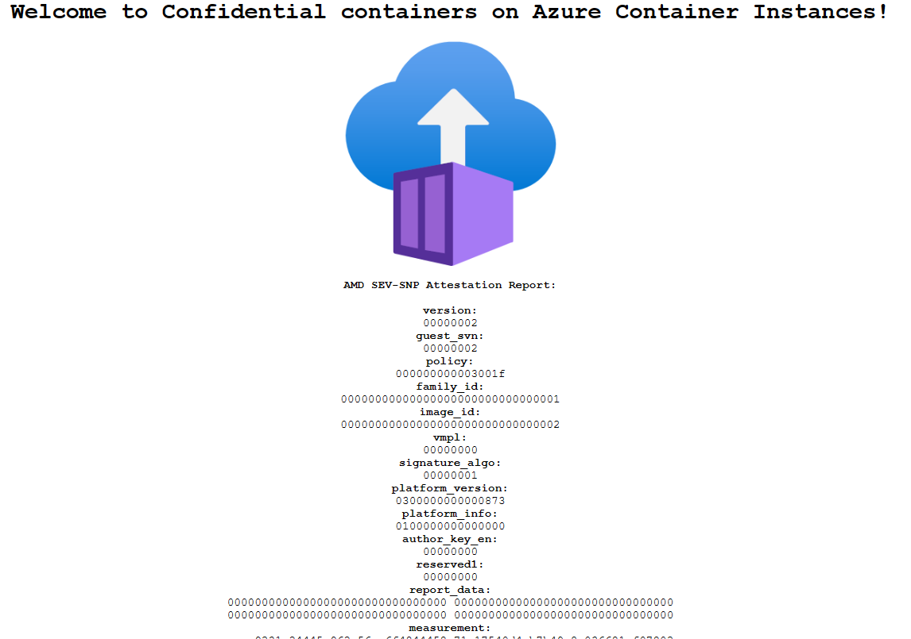

# Azure Container Instances Confidential Hello World

This sample is a basic Python application used to demonstrate [Confidential Containers on Azure Container Instances](aka.ms/aci). In this sample an AMD SEV SNP report containing the container groups firmware measurements will be displayed in a Python Flask web application.

The packaged version of this application is available on [Microsoft Container Registry](https://mcr.microsoft.com/v2/aci/aci-confidential-helloworld/tags/list).

## Getting Started

### Tutorials

* [Deploy via Portal](https://aka.ms/aciccportal)
* [Deploy via ARM with a custom confidential computing enforcement policy](https://aka.ms/aciccarm)

## Contributing

This project welcomes contributions and suggestions.  Most contributions require you to agree to a
Contributor License Agreement (CLA) declaring that you have the right to, and actually do, grant us
the rights to use your contribution. For details, visit <https://cla.opensource.microsoft.com.>

When you submit a pull request, a CLA bot will automatically determine whether you need to provide
a CLA and decorate the PR appropriately (e.g., status check, comment). Simply follow the instructions
provided by the bot. You will only need to do this once across all repos using our CLA.

This project has adopted the [Microsoft Open Source Code of Conduct](https://opensource.microsoft.com/codeofconduct/).
For more information see the [Code of Conduct FAQ](https://opensource.microsoft.com/codeofconduct/faq/) or
contact [opencode@microsoft.com](mailto:opencode@microsoft.com) with any additional questions or comments.
